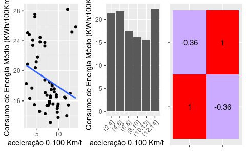

# Forecasting the Energy Consumption of Eletric Cars

A transport and logistics company wants to migrate its fleet to electric cars in order to reduce costs.

Before making the decision, the company would like to forecast the energy consumption of electric cars based on various usage factors and vehicle characteristics.

Using a real dataset with [publicly available](https://data.mendeley.com/datasets/tb9yrptydn/2), a Machine Learning model will be built capable of predicting the energy consumption of electric cars based on several factors, such as the type and number of electric motors in the vehicle, vehicle weight, load capacity, among other attributes.

This dataset lists all-electric cars that, as of December 2, 2020, could be purchased in Poland as new at an authorized dealership and those available in public and general pre-sale, but only if a publicly available price list with complete equipment versions and technical parameters was available. with your attributes

The collection does not contain data on hybrid cars and electric cars of so-called “range extenders”. Hydrogen cars were also not included in the dataset due to the insufficient number of mass-produced models and the different specificity (compared to electric vehicle) of the vehicle, including the different charging methods.

The database composed of 53 electric cars (each variant of a model – which differs in terms of battery capacity, engine power, etc. – is treated separately) and 22 variables (25 variables, including brand, model and “car name”). car” merging these two previous ones).

## Attribute List

- Car full name	
- Make	
- Model	Minimal price (gross) [PLN]	
- Engine power [KM]	
- Maximum torque [Nm]	
- Type of brakes	
- Drive type	
- Battery capacity [kWh]	
- Range (WLTP) [km]	
- Wheelbase [cm]	
- Length [cm]	
- Width [cm]	
- Height [cm]	
- Minimal empty weight [kg]	
- Permissable gross weight [kg]	
- Maximum load capacity [kg]	
- Number of seats	
- Number of doors
- Tire size [in]
- Maximum speed [kph]
- Boot capacity (VDA) [l]
- Acceleration 0-100 kph [s]
- Maximum DC charging power [kW]	
- mean - Energy consumption [kWh/100 km]

## Solution Strategy

In order to solve this challenge, the work went along the following steps:

1. **Data Description:** understanding of the status of the database and dealing with missing values properly. Basic statistics metrics provide an overview of the data.  
2. **Data Filtering:** filtering of records and selection of attributes that do not contain information for modeling or that do not match the scope of the business problem.
3. **Exploratory Data Analysis (EDA):** exploration of the data searching for insights and seeking to understand the impact of each variable on the upcoming machine learning modeling.
4. **Data Preparation:** preprocessing stage required prior to the machine learning modeling step.
5. **Feature Selection:** selection of the most significant attributes for training the model.
6. **Machine Learning Modeling:** implementation of a few algorithms appropriate to the task at hand. In this case, models befitting the *regression* assignment - *i.e.*, forecasting a continuous value, namely sales.
8. **Translation and Interpretation of the Model Performance:** conversion of the performance metrics of the Machine Learning model to a more tangible business result.

Fice hypotheses were validated in the exploratory data analysis. Below are 3 of the hypotheses that were arrested:

- **Hypothesis 1:** Cars that have a shorter acceleration time from 0 to 100 km/h have a higher average energy consumption.
   

***True:*** according to the graphs, the correlation coefficient is slightly negative, indicating that there is a weak negative correlation between the variables.
